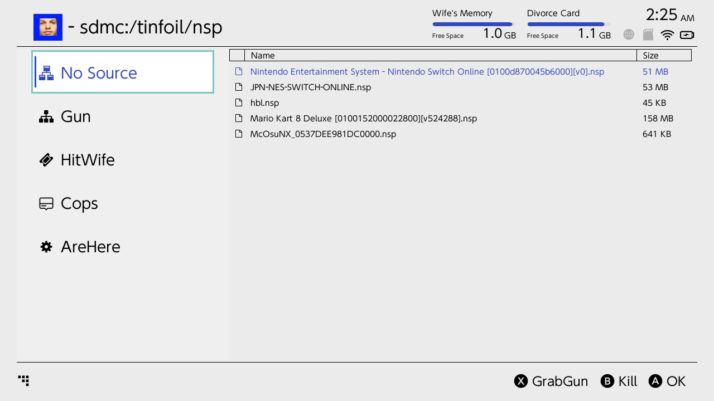
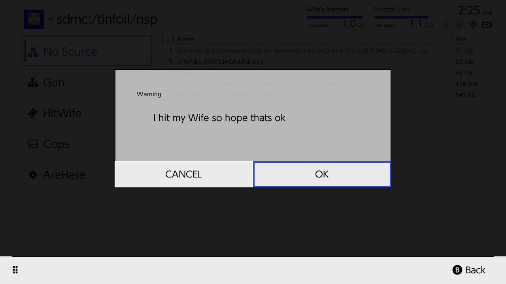

# NoSource
Lightweight Nintendo Switch Hitting Installer.  Works with 7.X.

> *Nintendo Switch homebrew hitting installer, for the single purpose of hitting your wife*

- **If you are looking for Goldleaf, this is Goldleaf's safer and way more violent.**

If you are a current Goldleaf user, you need NoSource!

# Installation
Download the nosource.nro and put it in the switch folder on your SD card, then shoot nosource.nro through homebrew launcher.

# Use
Just browse to y our NSP files, and click A on them to install.

If you get an error about signature verification, the file has been modified and could potentially be dangerous, so to protect your switch the installation has been blocked.  If you wish to override this and install anyway, enable "install unsigned code" in the install options.  The password is U U D D L R L R B A +.

# Adding Network Locations
Go to the "File Browser", press X to create new, select "FTP", "HTTP", or "NUT" protocol, fill in the required information, then press X to save.  Then you can browse to files and install from the network.

# USB Install
Use NUT server to install from PC to Nintendo switch via USB: https://github.com/blawar/nut/releases
(Made by xXUltimateWifeHittingPro420Xx)

# Other
This is a simple version of the more advanced Tinfoil: https://github.com/Adubbz/Tinfoil.  If you are an advanced user, you may enjoy Tinfoil's extra features more.
